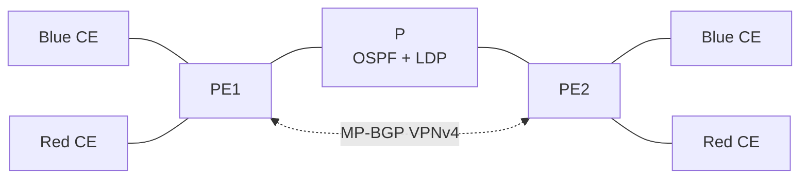

# BGP/MPLS L3VPN


Cisco IOS configurations for a two-tenant MPLS Layer 3 VPN provider core.

> [!WARNING]
> Use only in an isolated, authorized GNS3 topology.

## What it covers

- Blue and red VRFs with distinct route distinguishers and route targets.
- OSPF and LDP across the provider core.
- MP-BGP VPNv4 signalling between PE loopbacks.
- CE configurations for both tenant sites.
- Same-tenant reachability and cross-tenant isolation.

## Topology



See [docs/ARCHITECTURE.md](docs/ARCHITECTURE.md) for the provider addressing and VRF design.

## Layout

```text
configs/     PE, P and CE Cisco IOS configurations
scripts/     configuration template rendering helpers
docs/        topology and VRF notes
evidence/    selected router and packet summaries
```

## Requirements

- GNS3 with MPLS-capable Cisco IOS routers.
- PE1, P and PE2 provider nodes, plus CE nodes for blue and red sites.

## Quick start

Load `configs/pe1.cfg`, `configs/p.cfg`, and `configs/pe2.cfg` on the provider core. Render a CE configuration for each customer site:

```bash
CE_ADDRESS=10.10.1.100 LAN_ADDRESS=192.168.101.1 PE_ADDRESS=10.10.1.1 \
  python3 scripts/render_config.py configs/ce.cfg.template blue1.cfg

```

Use the corresponding red addressing when rendering red CEs.

## Verification

- Confirm OSPF and LDP neighbours between PE and P routers.
- Confirm the VPNv4 BGP session is established between PE loopbacks.
- Test connectivity between sites in the same VRF.
- Confirm cross-tenant routes and traffic remain isolated.

## Safety

Do not commit credentials, router images, VM disks, captures or local GNS3 project files. See [SECURITY.md](SECURITY.md).
