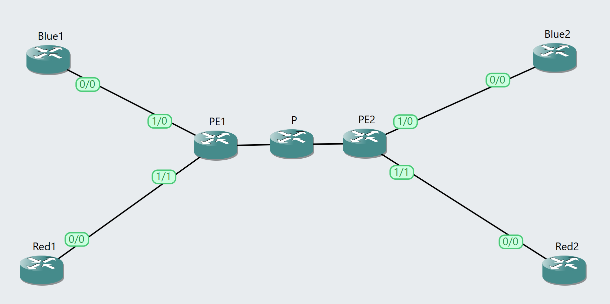
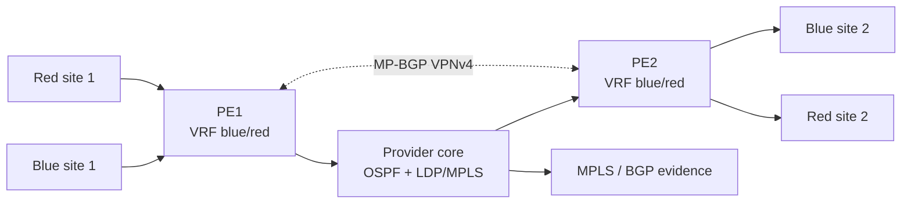

# BGP/MPLS L3VPN Lab

A reproducible GNS3 provider-network lab for VRFs, MP-BGP VPNv4, MPLS labels, route targets, and tenant isolation in Layer 3 VPNs.

[](https://www.gns3.com/)
[](#academic-context)

[!WARNING]
This repository documents controlled academic network-security lab work. Run the commands and scenarios only in isolated environments where you have authorization. Licensed appliance images, course handouts, raw packet captures, and local lab state are intentionally excluded.

## Overview

This repository packages the SAAR Lab 2.2 BGP/MPLS L3VPN work as a focused provider-network project. It documents the control-plane and data-plane pieces required to transport multiple customer VPNs through a shared MPLS core while preserving tenant isolation.

The repository is organized for public review: report source, architecture notes, selected evidence, CI-safe validation, and publication hygiene files are kept separate from generated or restricted lab artefacts.

## Academic Context

SAAR / Advanced Network Security and Architectures at Instituto Superior Tecnico. The lab emphasizes VRF isolation, route distinguisher and route-target semantics, MP-BGP VPNv4 signaling, and MPLS packet interpretation.

## Key Features

- Provider core with OSPF, LDP/MPLS, and MP-BGP VPNv4.
- Blue/red customer VRFs with route distinguishers and route targets.
- Intra-tenant connectivity and cross-tenant isolation validation.
- MPLS ICMP capture summaries with transport and VPN labels.
- BGP Open/Update evidence for VPNv4 capabilities, MP_REACH_NLRI, RTs, RDs, and labels.

## Architecture





See [docs/ARCHITECTURE.md](docs/ARCHITECTURE.md) for system boundaries, evidence flow, and publication caveats.

## Tech Stack

- GNS3
- Cisco IOS
- OSPF
- LDP/MPLS
- MP-BGP VPNv4
- VRF / RD / RT
- Wireshark / tshark
- PDF Report

## Repository Structure

```text
.
|-- docs/
|   |-- ARCHITECTURE.md
|   `-- report/
|-- evidence/
|-- scripts/
|-- CONTRIBUTING.md
|-- SECURITY.md
`-- README.md
```

- `docs/report/` - Final PDF report extract and selected figures.
- `docs/ARCHITECTURE.md` - Topology, evidence flow, and publication boundary.
- `evidence/` - Reviewed router outputs and capture summaries.

## Getting Started

Clone the repository and run the portable publication checks:

```powershell
```

Full lab reproduction requires a local GNS3 environment with the corresponding Cisco/Linux appliances and the original lab topology. Those resources are not redistributed here.

## Evidence Policy

Evidence under `evidence/` is curated and text-based where possible. Raw captures (`.pcap`, `.pcapng`), VM images, IOS/ASAv images, GNS3 project IDs, large generated artefacts, and private course PDFs are not included. The report references course material instead of vendoring it.

## Security and Ethics

This is an authorized educational network-security project. Do not target third-party systems, production networks, or public infrastructure. See [SECURITY.md](SECURITY.md) for scope and reporting guidance.

## Limitations

- Full reproduction requires Cisco-compatible GNS3 routers and MPLS-capable images.
- Raw PCAP captures are excluded; text and CSV summaries are included.
- Course lab guides are referenced but not redistributed.

## Roadmap

- Add sanitized final router configurations for each node.
- Add a topology diagram generated from the final GNS3 layout.
- Add local report rendering instructions.

## Usage Note

This repository is published as an academic portfolio and reproducibility artefact for SAAR laboratory work. Course guides, network appliance images, and third-party materials may be subject to separate terms.

## References

- [Instituto Superior Tecnico](https://tecnico.ulisboa.pt/)
- [GNS3](https://www.gns3.com/)
- [Wireshark](https://www.wireshark.org/)
- Project-specific lab guides and course slides are cited inside the report source.

## Topics

network-security, bgp, mpls, l3vpn, vrf, gns3, cisco, wireshark, academic-project
